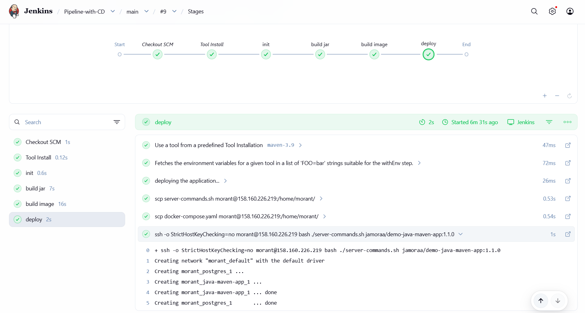
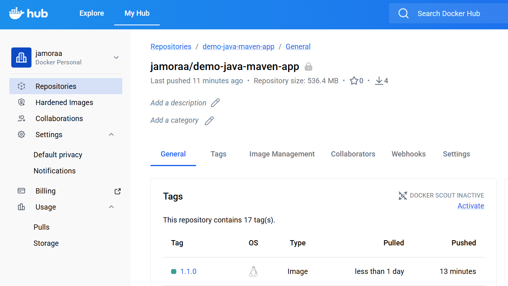
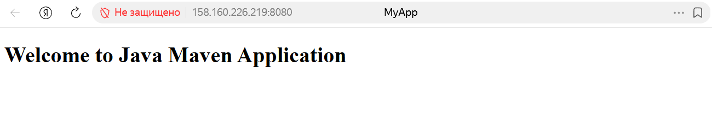
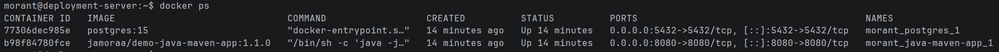

# Demo Project

## 📌 Overview
CD - Deploy Application from Jenkins Pipeline on Compute Cloud(Yandex Cloud Service) Instance (automatically with docker-compose)

---

## 🛠 Technologies Used
- Yandex Cloud
- Jenkins
- Docker
- Linux
- Git
- Java
- Maven
- Docker Hub

---

## 📖 Project Description
- Install Docker Compose on Yandex Cloud Compute Cloud Instance
- Create docker-compose.yml file that deploys our web application image
- Configure Jenkins pipeline to deploy newly built image using Docker Compose on Yandex Cloud Compute Cloud server
- Improvement: Extract multiple Linux commands that are executed on remote server into a separate shell script and execute the script from Jenkinsfile

---

## 🌐 Live Demo
The Jenkins server is deployed using Yandex Cloud:

http://158.160.227.106:8080/

The application can be accessed on this address:

http://158.160.226.219:8080/

> ⚠️ Note: The addresses may be temporarily unavailable if the cloud server is inactive (for example, if the hosting service has not been paid).

---

## 📸 Screenshots

